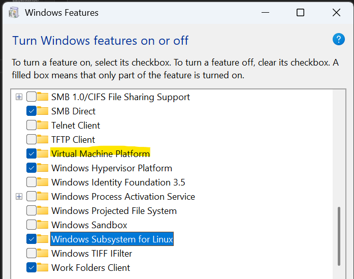
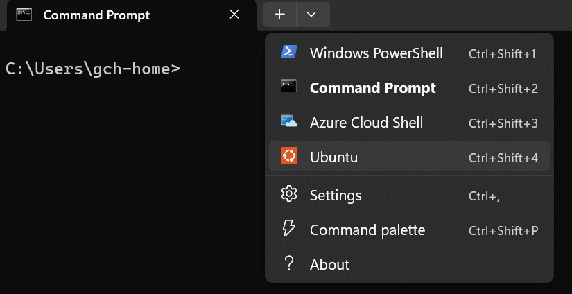
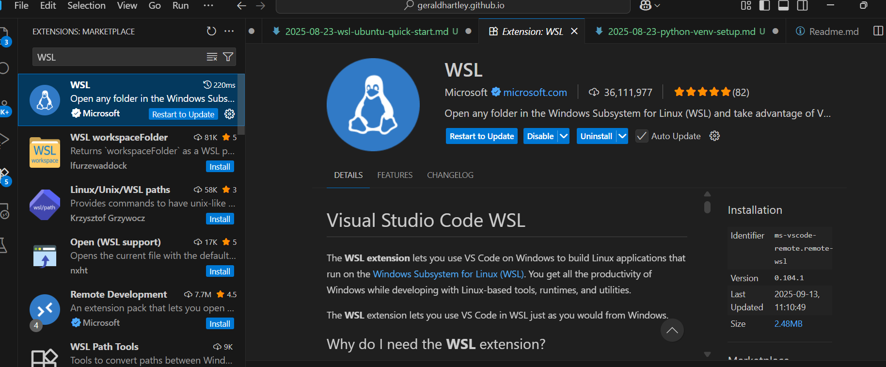
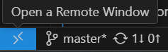
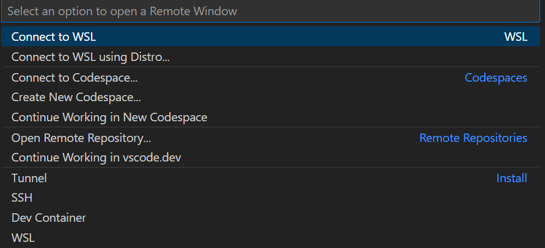
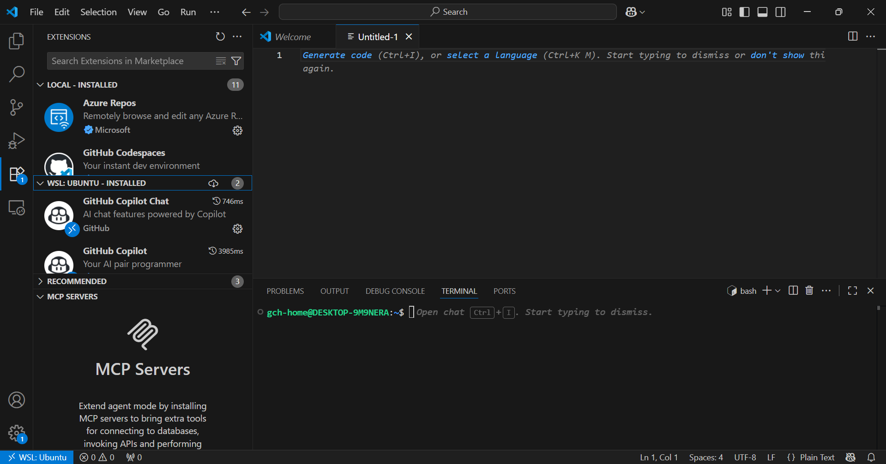

In this post, I'll be documenting the setup and configuration of the Windows Subsystem for Linux (WSL2).

Users running a Windows operating system can now run a distribution of Linux virtually within their Windows environment, without the need to reinstall their OS, dual boot into seperate environments, or pay for a cloud-based VM.

Modern data tools such as dbt-core require a Python runtime environment to use. While it's possible to run these on a Windows machine with Python for Windows / Anaconda, running on a Unix-based distribution allows for a seamless, integrated experience which ties nicely into modern automation & CI/CD platforms and tools.

### Prerequisites

1. Windows Profesisonal Edition or higher. Windows Home edition will not allow you to enable virtualisation, so you may need to consider virtual machine options such as cloud VM or Github Codespace

2. (Optional) VS Code - IDE which will allow you to connect to your WSL environment

### Install WSL and Ubuntu Distribution:

1. Enable Virtualisation components. In your start menu, search for 'Turn Windows features on or off'. Tick the checkboxes next to 'Virtual Machine Platform' and Windows Subsystem for Linux. Restart your machine once installs are complete.


2. Once restarted, open up Command Line and enter the command: ```wsl --install Ubuntu``` to install the Ubuntu distro.

3. Use the dropdown menu on the Command Prompt to open a new tab. You should now see the Ubuntu option is availble.


4. Start a new Ubuntu terminal window. You will be prompted to enter your admin username and password

### WSL with VS Code

VS Code integrates with WSL distributions, providing a streamlined way to access, develop and run applications directly through your virtual environment. I highly recommend using this approach when developing applications with WSL distributions.

1. Open VS Code, head to Extensions and install the WSL extension for VS Code


2. Once installed, click the blue button on the bottom left of the window. This will open the Command Palette at the top of your screen, and prompt you to open up a new Remote session:


3. Select 'Connect to WSL', which will connect to your default distribution. If you have multiple distributions installed, select 'Connect to WSL using Distro' and select the distribution you wish to connect to. 

Note that your window may reload, and prompt you to save any files before reloading. If you wish to keep a your open without restarting, open a new VS Code window (Ctrl + Shift + N) and then Connect to WSL

4. Check that the window is now showing that your connected to your Remote: Ubuntu environment. Open the terminal (Ctrl + `) to access the bash terminal of your distribution


5. Extensions wont carry over between your Windows and Linux based environments, so you may need to reinstall extensions for your distribution.

If you are Windows user who is unfamiliar with using Linux, use this guide for a quickstart to using basic bash commands with your WSL distribution: <a href="https://learn.microsoft.com/en-us/windows/wsl/tutorials/linux">Getting started with Linux and Bash
</a>


We will build on this environment in our next article, where we set up Python and a Python Virtual Environment.