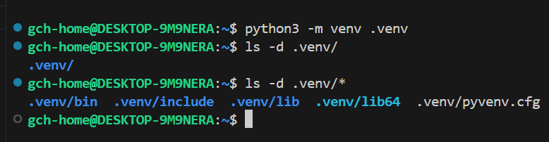
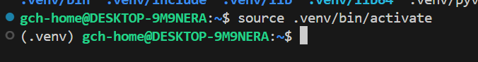
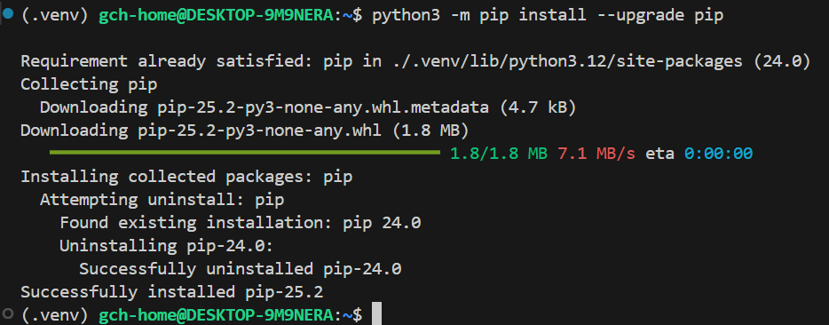

In a <a href="./2025-08-23-wsl-ubuntu-setup.md">previous post</a>, we've set up our Windows Subsystem for Linux (WSL) environment, and have chosen Ubuntu as our distribution of choice.

Our next step will be to configure Python, and set up a new Python virtual environment using venv.

Python by far the most popular coding language used within the Modern Data Platform. While it's arguable that you won't need a 'deep' knowledge with Python to be productive, knowing how to ingest, manipulate and transform data is a minimum requirement for any Data Engineer or Data Scientist.

Each Python script or project you run will have a specific set of libraries and packages required to run. Some of these libraries and packages will require specific versions to run, which may not be cross-compatible between projects.

If we were to run all our projects in a single environment, we'll eventually come across compatibility issues between environments. A Python virtual environment alleviates this by creating a virtual environment in isolation, and allows the developer to install libraries and packages specific to the project that is being worked on. 

Typically we'll see 1 project, be it a script, library or app,  contained in its own virtual environment. If we are working on multiple projects, then it'll make sense to create seperate virtual environments with their own specific package requirements.

Setting up a new virtual environment is simple and easy to do. The following steps will outline how to setup, use, and exit a virtual environment.

### Prerequisites

1. An operating system which has a Python runtime environment. For our example, we will build on our previous post - <a href="./2025-08-23-wsl-ubuntu-setup.md">Install Windows Subsystem for Linux (WSL) with Ubuntu Distribution</a>. However, tools like Anaconda or Python for Windows can also be used.

2. VS Code - IDE which will allow you to connect to your WSL environment, installing extentions which integrate with both Python tools and WSL distributions

### Installation steps
1. Ensure your package manager is up to date. Since we're using an Debian based distribution in Ubuntu, in our example, we'll start by using ```sudo apt update``` to ensure we have the latest packages available.

2. Next we'll set up our virtual environment. Depending on how your default Python path is set, you will either use ```python -m venv .venv``` or ```python3 -m venv .venv```

3. Once created, a new .venv directory will show in the directory where you ran this command. In the example, I ran this under the root directory of my instance, so it appears under here:


4. Now we'll activate the environment using the command ```source .venv/bin/activate```. You should see the prefix ```(.venv)``` appear before your user in your command window.


5. We'll upgrade pip (Python's package manager) to the latest version by using ```python3 -m pip install --upgrade pip```



Now you're ready to use your Python virtual environment for development. When you restart your session you may not be automatically logged in to your virtual environment, in which case activate your virtual environment as described in Step 4. 

If you're using VS Code, you'll be able to configure your workspace to automatically log in to your virtual environment. We'll cover this and other tips in a future article.